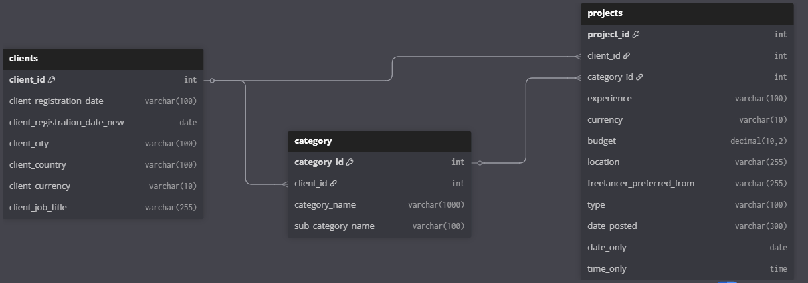

# Project Pulse
## Project Overview:

Freelancers and clients operate in a competitive marketplace. Understanding which projects pay more, which clients engage faster, and which markets are most lucrative can give a strategic edge. This project explores these insights using historical freelance project data

## Objective:

Help new freelancers maximize their earnings and identify high-value opportunities in the freelance marketplace through data-driven insights.

## Data Description:
| **Table Name** | **Key Columns**                                                                                           | **Description / Role**                                                                                               |
| -------------- | --------------------------------------------------------------------------------------------------------- | -------------------------------------------------------------------------------------------------------------------- |
| **Projects**   | `Project_ID`, `Client_ID`, `Experience`, `Budget`, `Location`, `Freelancer_Preferred_From`, `Date_Posted` | Contains details about individual projects, including budget, experience level required, location, and posting date. |
| **Clients**    | `Client_ID`, `Client_Country`, `Client_Registration_Date`                                                 | Holds client information such as country and registration date, helping track client behavior.                       |
| **Category**   | `Category_ID`, `Category_Name`, `Sub_Category_Name`                                                       | Maps projects to categories and subcategories, providing context for analysis and insights.                          |

## ERD



## Data Clening Steps:
Before performing the analysis, the dataset required cleaning and formatting to ensure accuracy and consistency. 
The key steps were:

1. Handling missing values:

    Checked for NULLs across all tables and dropped columns that were mostly empty (placeholder named my_column). This ensured cleaner, more reliable analysis.

2. Standardizing the Experience column in Projects:
    Removed the ($) signs and parentheses from experience levels for easier analysis.

    <pre>UPDATE Projects SET Experience = REPLACE(REPLACE(REPLACE(Experience, '(', ''), ')', ''), '$', ''); </pre>

3. Converting dates and extracting components:

    The Date_Posted column in Projects was in VARCHAR format. It was converted to proper date and time formats, and two new columns were created: Date_Only and Time_Only. 
    <pre>UPDATE Projects
    SET Date_Only = DATE(STR_TO_DATE(Date_Posted, '%d-%m-%Y %H:%i')),
    Time_Only = TIME(STR_TO_DATE(Date_Posted, '%d-%m-%Y %H:%i'));
    </pre>

4. Adding a new column in Clients:

    A new column was created to facilitate analysis (e.g., extracting registration month or day)

## Executive Summary:

Expert-level budgets surge most in Technology & Programming (+560%) and Marketing/Branding (+460%), while Music & Audio (+120%) and Design (+150%) show smaller increases. Niche subcategories like Videography and Mobile App Development, with under 5% of postings, still command the highest total budgets. 

Countries with few but high-value postings include Germany, and Algeria, while US and UK offer scalable high-budget markets. Clients convert fastest to posting in Music & Audio (~3.1 yrs) versus slowest in Business (~4.4 yrs).

Finally, Canada excels in Tech & Digital Marketing, Spain dominates Music, US leads in Business & Creative, UK offers broad small premiums, and India overspends in Marketing

##  Business Insights & Analysis:

### 1. How does experience affect the median project budgets?
```sql
WITH ranked AS (
    SELECT 
        c.CATEGORY_NAME, 
        p.EXPERIENCE,
        p.BUDGET,
        ROW_NUMBER() OVER (PARTITION BY c.CATEGORY_NAME, p.EXPERIENCE ORDER BY p.BUDGET) AS rn,
        COUNT(*) OVER (PARTITION BY c.CATEGORY_NAME, p.EXPERIENCE) AS total_count
    FROM PROJECTS p
    JOIN CATEGORY c 
        ON p.PROJECT_ID = c.CATEGORY_ID
    WHERE p.EXPERIENCE IN ('Entry', 'Expert')
),
median_calc AS (
    SELECT 
        CATEGORY_NAME, 
        EXPERIENCE,
        CASE 
            WHEN total_count % 2 = 1 
                THEN CAST(
                    MAX(CASE WHEN rn = (total_count + 1) / 2 THEN BUDGET END) AS DECIMAL(10,2)
                )
            ELSE 
                CAST(
                    (MAX(CASE WHEN rn = total_count / 2 THEN BUDGET END) +
                     MAX(CASE WHEN rn = (total_count / 2) + 1 THEN BUDGET END)) / 2.0 AS DECIMAL(10,2)
                )
        END AS MEDIAN_BUDGET
    FROM ranked
    GROUP BY CATEGORY_NAME, EXPERIENCE, total_count
),
pivot AS (
    SELECT 
        category_name,
        MAX(CASE WHEN experience = 'Expert' THEN median_budget END) AS expert_median,
        MAX(CASE WHEN experience = 'Entry' THEN median_budget END) AS entry_median 
    FROM median_calc
    GROUP BY category_name
)
SELECT 
    category_name,
    expert_median,
    entry_median, 
    ROUND(((expert_median - entry_median)/entry_median)*100) AS pct_increase 
FROM pivot;
```
### Insights:

* Technology & Programming commands the highest premium, with a 560% jump from Entry ($50) to Expert ($330), showing the strongest demand for expertise.

- Marketing-focused fields (Marketing, Branding & Sales at 460% and Digital Marketing at 333%) also see steep increases, reflecting the high value placed on experienced professionals in driving growth.

- Creative domains like Video, Photo & Image (400%), Social Media (303%), and Writing & Translation (175%) reward expertise, though to a lesser extent than technical and marketing roles.

- Music & Audio (120%) and Design (150%) show the smallest increases, suggesting more limited budget differentiation between entry-level and expert professionals.

### 2.Hidden Revenue in Rare Subcategories:

```sql
WITH subcat_stats AS (
    SELECT 
        c.sub_category_name,
        COUNT(p.project_id) AS total_postings,
        SUM(p.budget) AS total_budget
    FROM category c
    JOIN projects p 
        ON c.category_id = p.project_id
    GROUP BY c.sub_category_name
),
overall_stats AS (
    SELECT 
        SUM(total_postings) AS grand_total_postings
    FROM subcat_stats
),
filtered_subcats AS (
    SELECT 
        s.sub_category_name,
        s.total_postings,
        s.total_budget,
        (s.total_postings * 100.0 / o.grand_total_postings) AS posting_percentage
    FROM subcat_stats s
    CROSS JOIN overall_stats o 
    WHERE (s.total_postings * 100.0 / o.grand_total_postings) < 5
)
SELECT 
    sub_category_name,
    total_postings,
    posting_percentage,
    total_budget
FROM filtered_subcats
ORDER BY total_budget DESC
LIMIT 3;
```

### Insights:
- Videography stands out as the top contributor, accounting for just 2.49% of total postings yet driving the highest budget allocation of $151,465.

- Mobile App Development follows closely, making up 1.88% of postings but contributing a significant $138,440 in total budget.

- Management & Development, despite only 1.03% of postings, still commands $124,657, showing high-value allocation relative to its low posting share.


### 3. High-Value Locations with Few Postings
```sql
WITH average AS (
    SELECT AVG(Budget) AS avg_budget_overall
    FROM projects
)
SELECT 
    Freelancer_Preferred_From,
    COUNT(*) AS total_postings,
    AVG(Budget) AS avg_budget,
    a.avg_budget_overall
FROM projects
CROSS JOIN average a
GROUP BY Freelancer_Preferred_From, a.avg_budget_overall
HAVING 
    COUNT(*) < 0.05 * (SELECT COUNT(*) FROM projects) 
    AND AVG(Budget) > a.avg_budget_overall
ORDER BY avg_budget DESC;
```

### Insights
- United States has a large budget advantage with an average of $970/project across 90 postings, making it the most promising sizeable market.

- Germany is another attractive market, with just 4 postings averaging $770/project, well above the global average.

- United Kingdom, despite 578 postings, still qualifies with an average of $405/project, showing strong budget capacity, but the higher posting count means competition is likely stronger.

- Smaller-volume countries like Algeria($340), Philippines($318), Uganda( $300), and Sweden ($300) each have fewer than 10 postings yet show above-average budgets per projects, indicating micro-market opportunities.


### 4. Industries with Shortest Lead Times
```sql
WITH JOINS AS (
    SELECT 
        ca.category_name AS industry,
        p.Date_Only,
        c.client_registration_date_new
    FROM PROJECTS p
    JOIN CLIENTS c 
        ON p.CLIENT_ID = c.CLIENT_ID
    JOIN CATEGORY ca 
        ON p.PROJECT_ID = ca.CATEGORY_ID
)
SELECT 
    j.industry,
    AVG(DATEDIFF(j.Date_Only, j.client_registration_date_new)) AS avg_days_difference
FROM JOINS j
GROUP BY j.industry
ORDER BY avg_days_difference ASC;
```
### Insights
- Music & Audio has the shortest lead time, with clients taking on average 1,145 days (~3.1 years) from registration to posting their first project.

- Writing & Translation (1,225 days) and Design (1,346 days) also show relatively shorter lead times, indicating faster conversion of registered clients into active project posters in creative industries.

- Marketing, Branding & Sales (1,430 days) and Video, Photo & Image (1,474 days) fall in the mid-range, with clients typically taking about 3.9–4 years before posting.

- Business (1,621 days) and Technology & Programming (1,600 days) show the longest lead times, averaging 4.4+ years, suggesting clients in these fields register early but delay project posting significantly

### 5. Country-Level Budget Trends
```sql
WITH TopCountries AS (
    SELECT c.client_country
    FROM Projects p
    JOIN Clients c ON p.client_id = c.client_id
    GROUP BY c.client_country
    ORDER BY COUNT(*) DESC
    LIMIT 5
),
CountryCategoryBudget AS (
    SELECT 
        c.client_country,
        ca.category_name,
        AVG(p.budget) AS avg_budget
    FROM Projects p
    JOIN Clients c ON p.client_id = c.client_id
    JOIN Category ca ON p.project_id = ca.category_id
    WHERE c.client_country IN (SELECT client_country FROM TopCountries)
    GROUP BY c.client_country, ca.category_name
),
GlobalCategoryAvg AS (
    SELECT 
        ca.category_name,
        AVG(p.budget) AS global_avg_budget
    FROM Projects p
    JOIN Category ca ON p.project_id = ca.category_id
    GROUP BY ca.category_name
)
SELECT 
    ccb.client_country,
    ccb.category_name,
    ccb.avg_budget,
    gca.global_avg_budget,
    (ccb.avg_budget - gca.global_avg_budget) AS difference_from_global
FROM CountryCategoryBudget ccb
JOIN GlobalCategoryAvg gca 
    ON ccb.category_name = gca.category_name
ORDER BY ccb.client_country, ccb.category_name;
```

### Insights
- Canada -> Strongest in Technology & Programming (+$1,122) and Digital Marketing (+$938) indicates a premium tech & marketing hub.

- Spain -> Huge outlier in Music & Audio ($5,032 vs $189 global) shows niche but very high-value music projects.

- United States -> Big budgets in Business (+$681) and Music & Audio (+$293) holds strong in business strategy & creative work.

- United Kingdom -> Balanced market, slightly above global in Design, Digital Marketing, Video & Writing is steady multi-category opportunity.

- India -> Generally below global averages, but spends more in Digital Marketing (+$309) and Marketing & Sales (+$191) and cost-sensitive but growth-focused.

## Recommendations 
- Focus on High-Paying Categories – Prioritize Technology & Programming (+560%) and Marketing & Sales (+460%) for maximum earning potential.

- Explore Lucrative Niches – Target subcategories like Videography ($151K) and Mobile App Development ($138K) that capture large budgets despite few postings.

- Leverage Geography – Position for high-budget, low-competition markets (e.g. Germany $771/project) while scaling in US ($970/project) and UK ($405/project).

- Engage Fast-Converting Industries – Build early presence in Music & Audio (1,145 days) and Writing (1,225 days) where clients post sooner.

- Tailor by Country – Canada = Tech/Marketing, Spain = Music, US = Business/Creative, UK = Multi-category, India = Marketing focus
